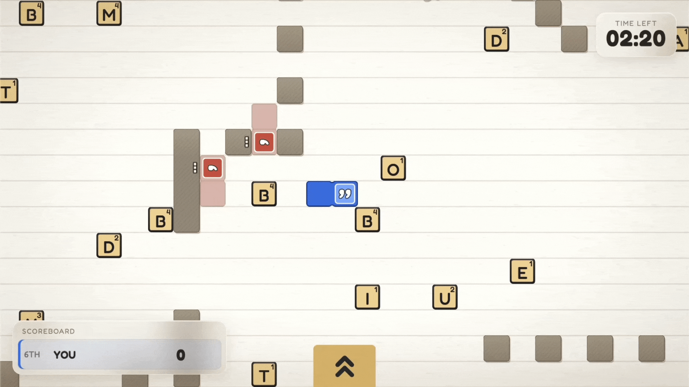
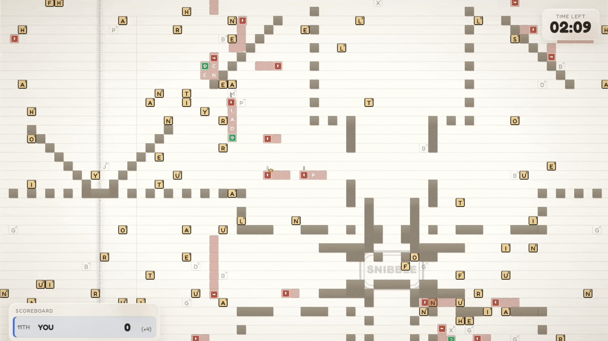
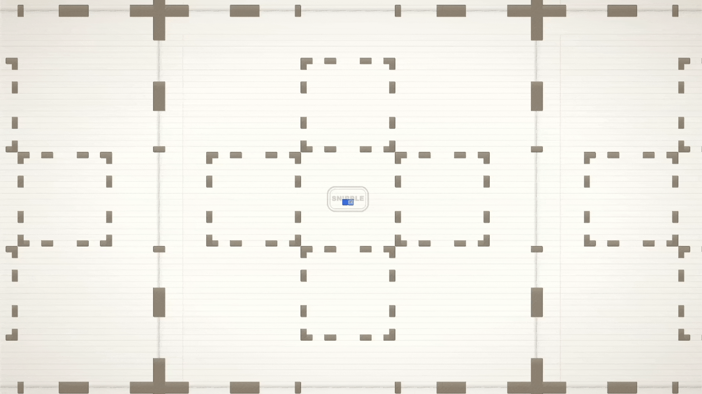
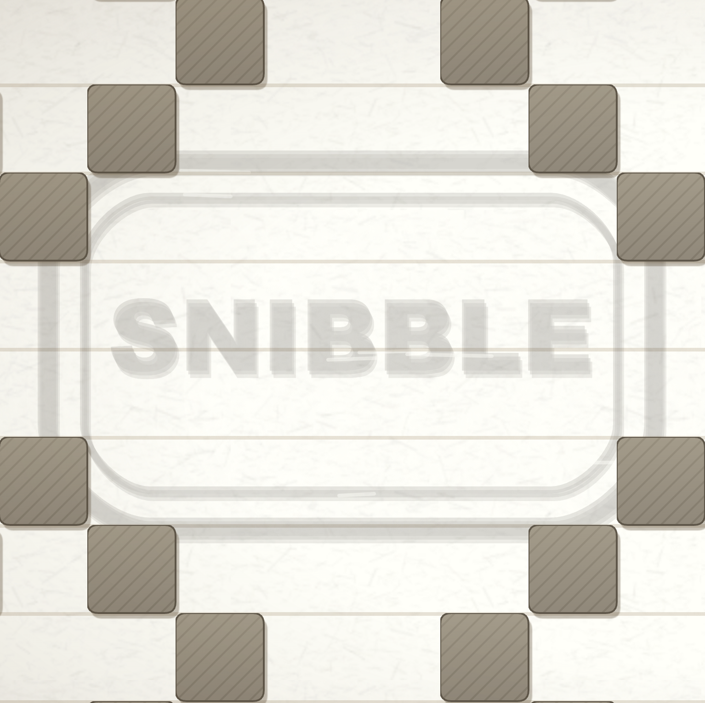
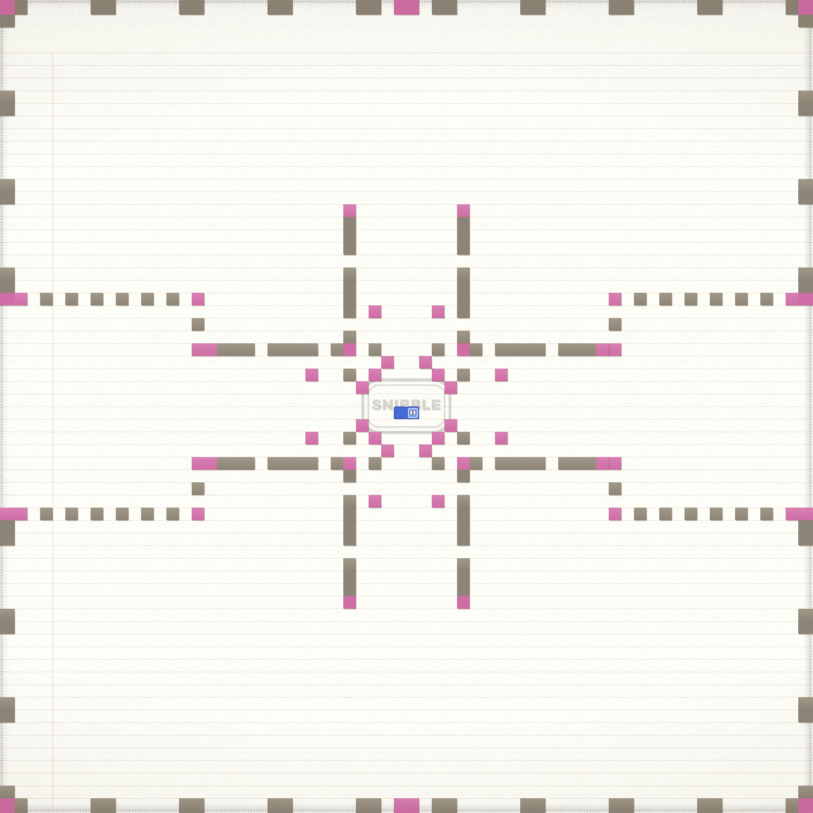

# Summary

> This write-up is being actively expanded (Work In Progress).

[Link to the Game](https://snibble.gg)

> Snibble started its life as a multiplyer word game combining Snake, Scrabble, and adversarial stealing mechanics.
>
> Over time, it has evolved into a game-engine and simulator.



### The engine features:

- Headless simulation
- Discrete movement and actions, yet continuous fluid rendering and animation
- Exact game replays with a scrubbable timeline (like a video player)
- Tiny QR-encodable replays
- Procuedral level generation (walls) and sound generation
- Configurable bot "genes" for bot behaviour, with imperfect information and perception levels
- A custom binary wire protocol for multiplayer games and replay compression
- An infinite toroidal board with zones and flow fields
- Fully separated logic and rendering

### The game loop:

- Collect letters
- Form a word
- Submit that word for points (by eating your tail)
- Steal words from other players or be stolen from

### It looks a bit like Conways Game of Life when Zoomed out



---

# Main Content

## Procedural Wall Generation

Walls are generated based on the seed and a custom shape grammar of 8x8 shape primitives. The shape primitives can be scaled up to different powers of 2, allowing for a wide variety of wall configurations.



### Wall Shape Primitives

Each shape primitive is an 8x8 "grid" of wall segments and "nodes". How it works is 2x8-byte masks that get combined

- Mask 1: Define a 8x8 shape primtive of nodes (think of them as line end-caps)
- Mask 2:Define a second 8x8 shape primitive of walls (think of them as line segments)
- Each bit in the mask is a boolean value, where 1 = wall/node and 0 = empty space. The two masks are combined to form a single 8x8 shape primitive.

| Wall Primitive Diamond Example                              | Zoomed out board with Nodes coloured in                    |
| ----------------------------------------------------------- | ---------------------------------------------------------- |
|  |  |

The node-wall stroke algorithm is a simple custom algorithm that draws a line between two nodes via line of sight, and then fills in the line with wall segments. The algorithm is designed to be fast and efficient, and it can handle a wide variety of wall configurations. In the above images, the nodes are pink, the walls are black, and the empty space is white. The walls are generated procedurally based on the seed, and they can be scaled up to different powers of 2. Walls can be connected via a solid or dotted "stroke" which is seed derived.

## Bot "Gene" System

Bots are driven by "genes", compact byte-encoded behavioural parameters that is used to make decisions. Each bot makes decisions by scoring candidate options and taking the highest-utility one. In previous gifs you can see bots hunting (!), thinking (...), or moving - if you look closely.

### Gene Variants

A gene belongs to one of seven categories, each of which can be tuned to a value between 0 and 255:

- `wordAmbition` — commit to short/fast words vs hold out for long, high-value ones
- `wordDiscipline` — strict valid-word play vs eats anything (garbage words, board chaos)
- `wordSense` — sticks to simple/common words (BOAT, CAT) vs form rare, obscure words (TSADES, QI)
- `aggression` — passive collector vs hunts other players tails
- `perception` — stops frequently to "think" and forgets board information vs stops infrequently and retains board information (my favourite gene - see note below)
- `caution` — reckless vs danger-averse
- `impulsiveness` — hoards letters and barely ejects them vs ejects them freely to escape or hunt or form a different word

### Perception Gene, or, Imperfect Information

> Bots are not oracles, they don't see the whole board ever. The board is segmented into zones, and a bot can only see its current zone and its 8 adjacent neighbouring zones.

Zones have masks over them which "hide" information from bots. So as bots play the game, they have imperfect information - just like a human. And just like a human, if they pause movement to stop and "scan" the board, the information is revelaed to them. But also just like a human, they forget what they saw after a while. The perception gene controls how often a bot stops to scan, and how long it remembers what it saw.

Why did I implement this? Becuase the game carries heavy processing overhead for humans, I first decided to implement non-continuous movement and actions so players can pause and think - unlike most snake games. Then I realised through playtesting that bots had perfect information so didn't have any need to pause, which caused an asymmetry in the game. I also did not want to introduce random pauses for bot movement, I wanted a more elegant solution akin to what the human player experiences. So partial information masking was the obvious solution given that the game was already segmented into power-of-2 zones.

---

To Discuss:

- Extreme compression
- Extreme performance
- Custom wire protocol
- Procedural level generation (walls)
  - Shape grammar of 8x8 shape primitives
  - Shape primitives can be scaled up to different powers of 2
- Procedural sound generation
- Discrete movement and actions
- Continuous fluid rendering and animation
- Fully separated logic and rendering
- Ability to run the game headless
- Infinite toroidal board
- Game replays
  - Spectate your own game
  - Spectate an enemies game
  - Change the camera subject dynamically
  - Play against your “ghost”
  - QR code that encodes the entire game replay
- Bot “gene” system for bot behaviour
  - Perception levels and imperfect information
  - Word forming ability and Word complexity ability
  - Stealing aggression levels
  - Zone masks
- Everything as a power of 2
  - Board dimensions
  - Inner board zones
  - Bot count
  - Bot gene parameters
  - Sound generation
- Word Dictionary
  - DAWG
  - Prefix / suffix complexity analysis
- Global state versus individual state
  - Flow fields
  - Zones

```

```
